# MPROXY

### Autonomous Endpoint Quality Platform

> A modular backend platform that continuously discovers, validates, evaluates and delivers healthy network endpoints through an automated quality pipeline.

<p align="center">
    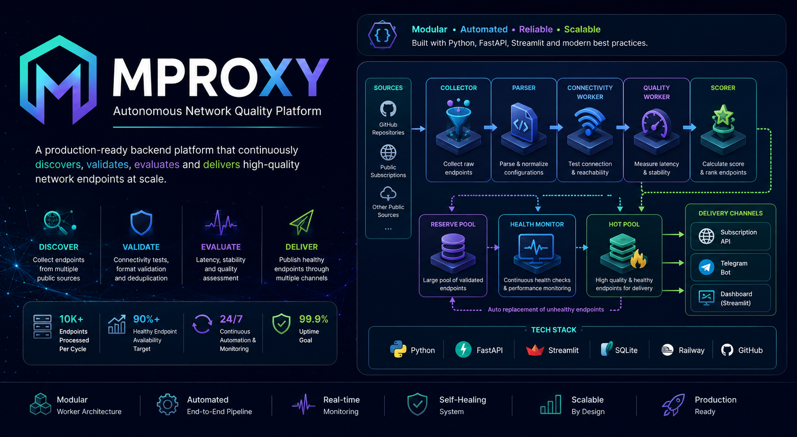
</p>

<p align="center">


</p>

---

## Overview

MPROXY is a backend automation platform designed to continuously discover, validate, evaluate and manage dynamic network endpoints.

Instead of relying on manually maintained endpoint lists, the platform continuously collects candidate endpoints, validates connectivity, evaluates quality, measures latency and promotes only healthy endpoints into the delivery layer.

Its modular architecture combines independent workers, automated pool management and continuous health monitoring to provide reliable endpoint delivery with minimal operator intervention.

---

## Core Capabilities

| Capability | Description |
|------------|-------------|
| Endpoint Discovery | Continuously collects endpoints from multiple public sources |
| Parsing & Validation | Parses, normalizes and validates endpoint configurations |
| Connectivity Testing | Verifies endpoint availability through automated runtime testing |
| Quality Assessment | Measures latency, stability and overall endpoint health |
| Endpoint Scoring | Calculates production readiness using quality metrics |
| Reserve Pool Management | Maintains validated backup endpoints |
| Hot Pool Management | Maintains production-ready endpoints |
| Health Monitoring | Continuously monitors production endpoint health |
| Automatic Failover | Automatically replaces degraded production endpoints |
| Delivery Services | REST API, Telegram Bot and subscription publishing |

---

## Deployment Architecture

The platform separates computational workloads from public service delivery.

Resource-intensive processing, validation and quality assessment execute on an independent processing node, while user-facing services remain isolated inside the delivery layer.

This separation prevents heavy workloads from affecting production services while allowing processing and delivery components to scale independently.

<p align="center">
    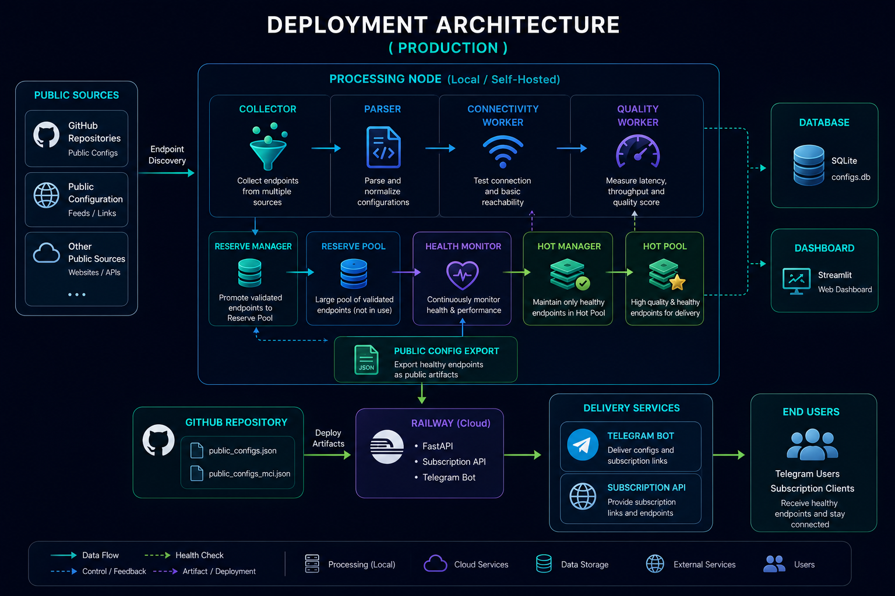
</p>

---

## System Architecture

The platform is organized as a collection of loosely coupled processing components.

Each worker performs a single responsibility within the processing pipeline while exchanging validated results with downstream stages.

This modular architecture improves maintainability, reduces coupling and enables continuous operation without interrupting production delivery.

<p align="center">
    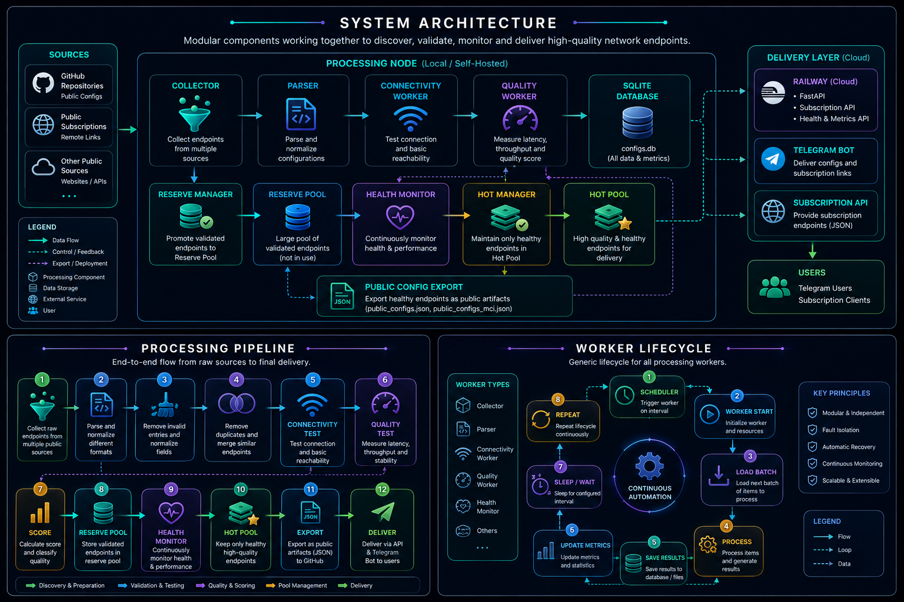
</p>

---

## System Workflow

Every endpoint passes through a fully automated processing workflow before becoming eligible for production delivery.

Only endpoints that successfully complete every validation stage are promoted into the production pool.

<p align="center">
    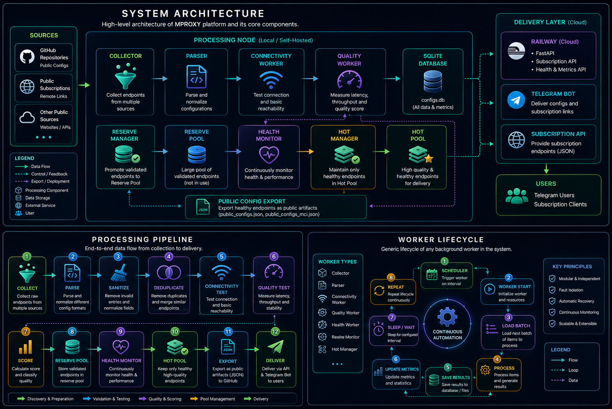
</p>

---

## Worker Lifecycle

Each worker executes independently, performs a dedicated responsibility and continuously exchanges validated data with adjacent processing stages.

Runtime metrics are updated automatically while unhealthy endpoints are replaced through continuous health monitoring and automated recovery mechanisms.

---

## Engineering Highlights

MPROXY is engineered as a long-running autonomous backend platform rather than a collection of standalone processing scripts.

The architecture prioritizes reliability, maintainability, observability and production resilience through a set of deliberate engineering decisions.

| Engineering Decision | Benefit |
|----------------------|---------|
| Independent Worker Architecture | Reduces coupling and simplifies maintenance |
| Multi-stage Validation Pipeline | Prevents invalid endpoints from reaching production |
| Continuous Quality Evaluation | Continuously measures endpoint quality and stability |
| Reserve & Hot Pool Architecture | Enables automatic recovery without service interruption |
| Automatic Failover | Replaces degraded endpoints without manual intervention |
| Continuous Health Monitoring | Detects production failures and endpoint degradation in real time |
| Operational Dashboard | Provides live visibility into system state and production metrics |
| Runtime Observability | Monitors workers, logs and endpoint health continuously |
| Repository Pattern | Separates business logic from data persistence |
| Multi-channel Delivery | Publishes the same validated data through API, Telegram and subscription services |
| Fully Automated Pipeline | Minimizes operational overhead after deployment |


---

## Design Principles

The platform is built around a small set of engineering principles that guide every processing stage.

- Single Responsibility
- Modular Architecture
- Independent Workers
- Continuous Automation
- Fault Isolation
- Automated Recovery
- Production Reliability
- Operational Observability

---

## Key Technologies

| Category | Technologies |
|----------|--------------|
| Programming Language | Python 3.13 |
| Backend Framework | FastAPI |
| Dashboard | Streamlit |
| Database | SQLite |
| Runtime Validation | Xray Core |
| API | RESTful API |
| Bot Platform | Telegram Bot API |
| Architecture | Repository Pattern, Modular Workers |
| Deployment | Linux, Background Services |
| Version Control | Git & GitHub |

---

## Database Schema & Platform Overview

The persistence layer separates operational data from runtime metrics and endpoint management.

Repository abstractions isolate business logic from database operations, improving maintainability and simplifying future database migrations.

<p align="center">
    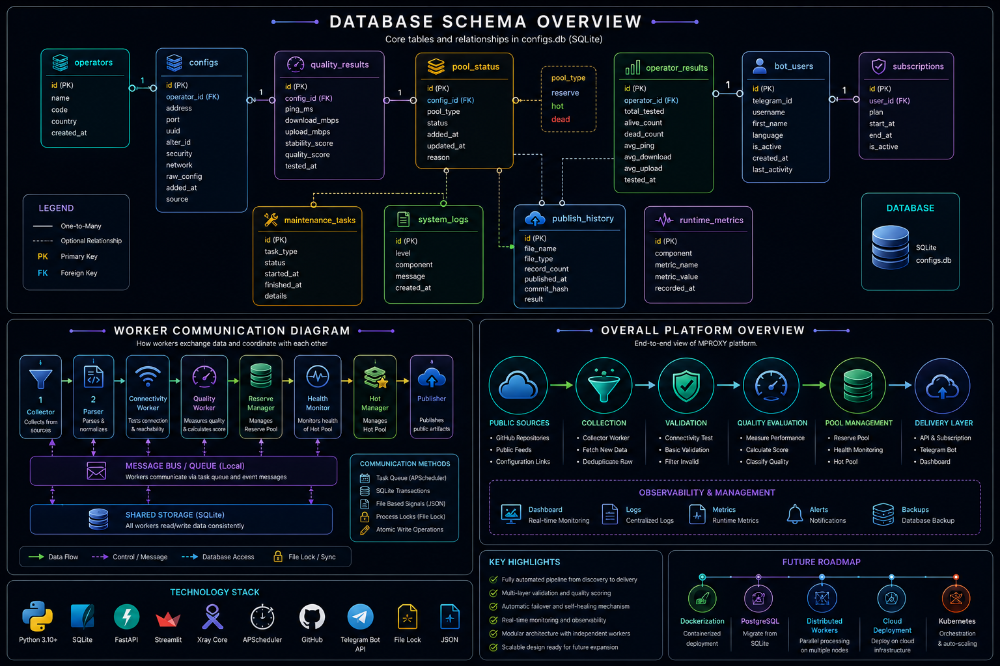
</p>

---

## Automatic Failover

Production endpoints are continuously monitored for availability and quality.

Whenever an endpoint becomes unavailable or falls below the required quality threshold, the platform automatically promotes a healthy candidate from the reserve pool without interrupting downstream delivery services.

<p align="center">
    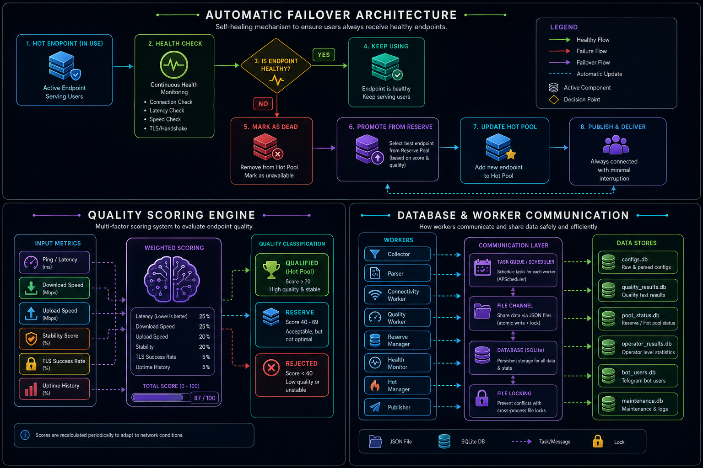
</p>

---

## Quality Scoring Engine

Endpoint selection is driven by a dedicated quality evaluation engine rather than simple connectivity checks.

Each candidate endpoint is evaluated using multiple quality indicators before receiving a production score.

Typical evaluation metrics include:

- Connectivity
- Latency
- Stability
- Availability
- Continuous Health Status

Only high-quality endpoints are promoted into the production pool.

<p align="center">
    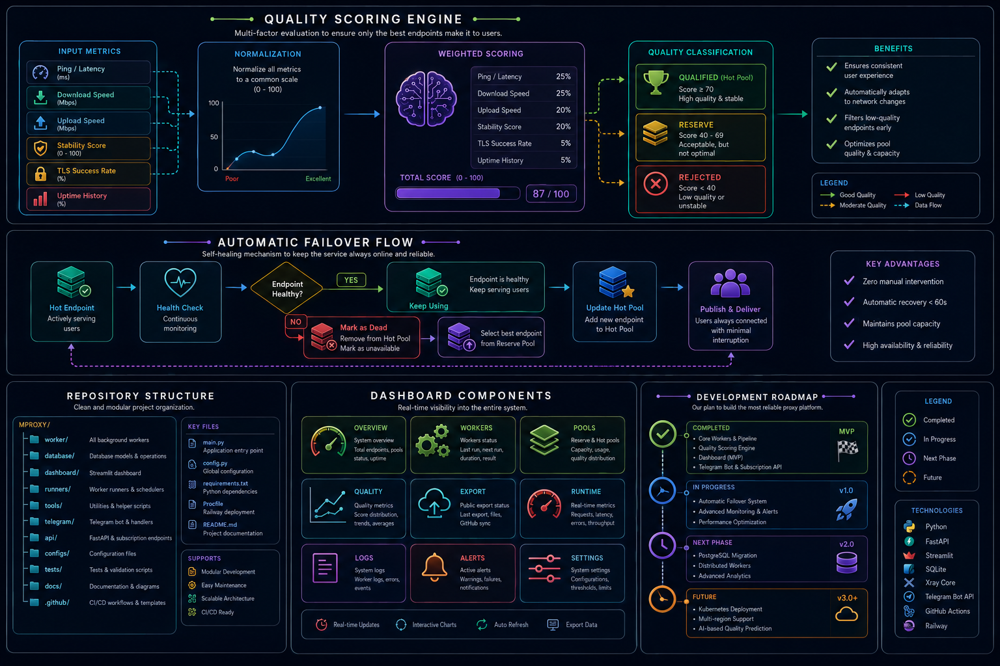
</p>

---

## Live Operational Dashboard

MPROXY includes a real-time operational dashboard designed for continuous platform supervision.

The dashboard provides visibility into every stage of the processing pipeline, including worker execution, endpoint validation, quality evaluation, pool management, runtime metrics and production delivery.

The interface is intended for operators who need to monitor system health, identify failures and verify production readiness from a single control panel.
---

### Platform Overview

Provides a high-level overview of the entire platform, including processing status, endpoint statistics and overall operational health.

<p align="center">
    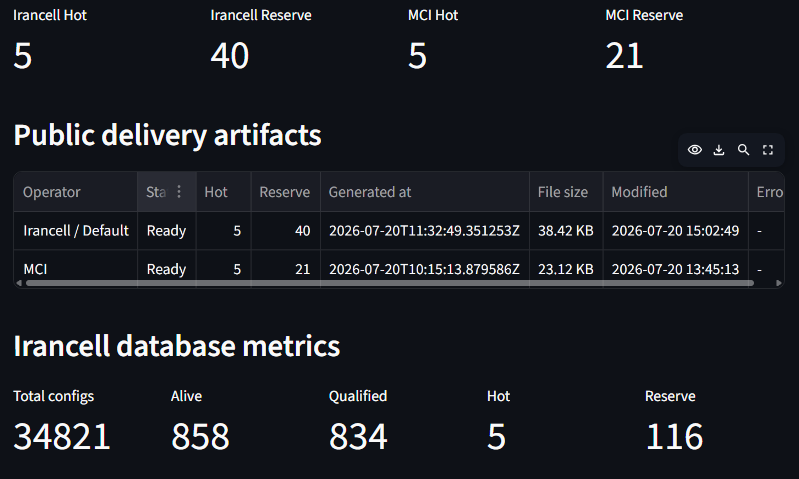
</p>

---

### Worker Monitoring

Every processing stage executes as an independent background worker.

The dashboard exposes worker status, process identifiers and runtime information to simplify operational supervision.

<p align="center">
    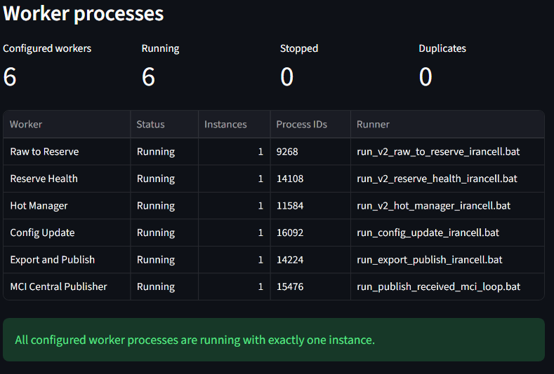
</p>

Independent workers improve fault isolation and allow individual processing stages to be maintained without interrupting the rest of the pipeline.

---

### Configuration Analytics

Visualizes large-scale statistics collected during automated validation.

These metrics provide operational insight into protocol distribution, validation success rate and overall endpoint quality.

<p align="center">
    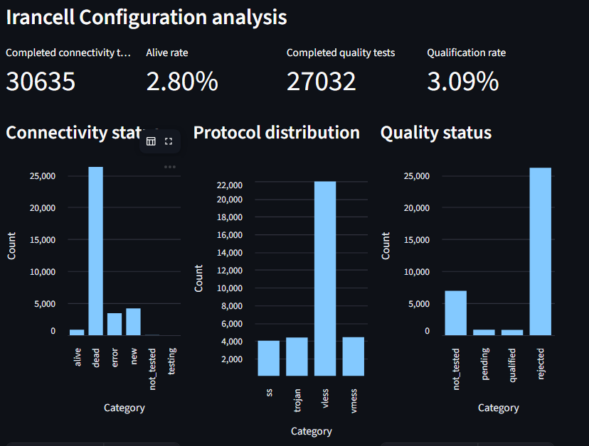
</p>

Charts allow operators to quickly identify trends without manually querying the database.

---

### Pool Monitoring

Production delivery is managed through separate Reserve and Hot pools.

The dashboard continuously monitors endpoint promotion, quarantine, health status and gate decisions.

<p align="center">
    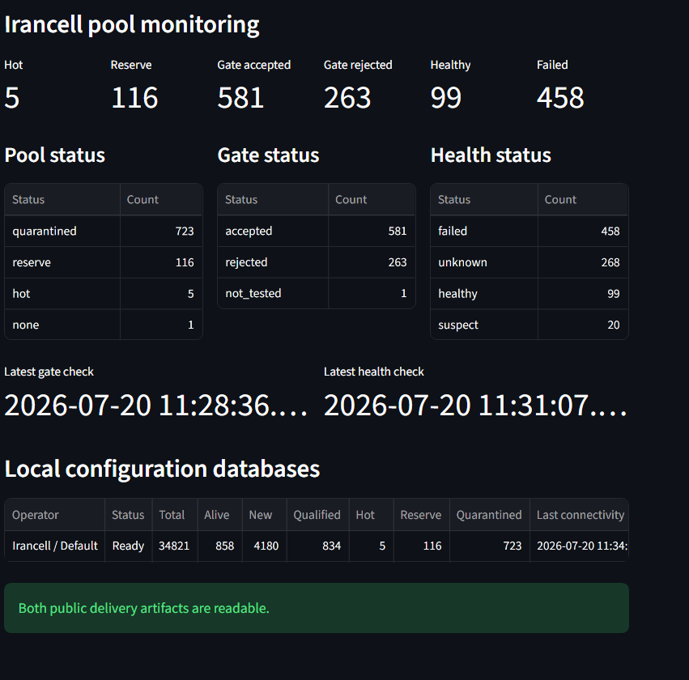
</p>

Automatic failover decisions are driven directly from these continuously updated pool states.

---

### Quality Evaluation

Displays the results of automated connectivity and quality validation.

Each endpoint is evaluated using runtime measurements before receiving a production score.

<p align="center">
    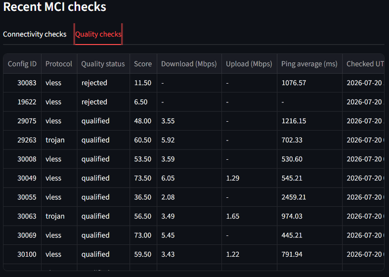
</p>

The dashboard exposes latency measurements, throughput tests, quality scores and qualification status for every processed endpoint.

---

### Runtime Logs

Operational logs are continuously monitored to verify that every worker remains active and healthy.

<p align="center">
    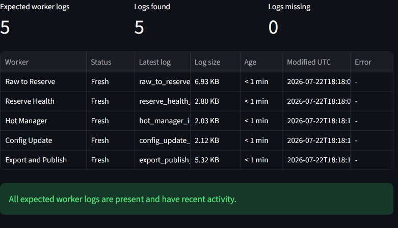
</p>

Fresh log activity provides immediate confirmation that background services are executing as expected and allows rapid diagnosis of operational failures.

---


## Project Structure

The repository is organized around independent processing components, allowing each subsystem to evolve with minimal coupling.

```text
MPROXY
│
├── dashboard/          # Operational monitoring dashboard (Streamlit)
├── database/           # Database models and repository layer
│   └── repositories/   # Data access abstractions
│
├── worker/             # Processing pipeline workers
│   ├── builders/       # Configuration builders
│   ├── parsers/        # Protocol parsers
│   └── core/           # Shared processing components
│
├── runners/            # Runtime validation engines
├── utils/              # Shared utility functions
├── tests/              # Automated test suite
├── tools/              # External runtime dependencies (Xray Core)
│
├── telegram_bot.py     # Telegram delivery service
├── subscription_api.py # REST API
├── main.py             # Platform entry point
│
└── assets/             # Documentation images
```

### Repository Organization

| Directory | Responsibility |
|-----------|----------------|
| `dashboard/` | Live operational dashboard and runtime monitoring |
| `database/` | Database models, repositories and persistence layer |
| `worker/` | Modular processing pipeline responsible for discovery, validation and quality evaluation |
| `builders/` | Generates standardized endpoint configurations |
| `parsers/` | Parses supported endpoint protocols |
| `runners/` | Executes runtime connectivity and quality validation |
| `tests/` | Automated testing utilities |
| `tools/` | External runtime components used during validation |
| `utils/` | Shared helper utilities |
| `telegram_bot.py` | Telegram-based endpoint delivery |
| `subscription_api.py` | Public subscription API |

## Getting Started

### Prerequisites

Before running the platform, ensure the following software is installed:

- Python 3.13+
- Git
- Xray Core (included in `tools/xray`)
- Windows PowerShell (recommended)

---

### Clone the Repository

```bash
git clone https://github.com/nm001970/MPROXY.git
cd MPROXY
```

### Create a Virtual Environment

```bash
python -m venv .venv
```

Activate the virtual environment:

```powershell
.venv\Scripts\activate
```

### Install Dependencies

```bash
pip install -r requirements.txt
```

---

### Running Background Workers

Start the automated processing pipeline:

```powershell
.\start_irancell_all_workers.bat
```

This launches the long-running workers responsible for endpoint collection, validation, quality assessment, health monitoring and pool management.

---

### Starting the Operational Dashboard

Launch the Streamlit dashboard:

```powershell
$env:V2RAY_RUNTIME_ROOT = (Get-Location).Path

python -m streamlit run `
    .\dashboard\app.py `
    --server.address 127.0.0.1 `
    --server.port 8501
```

After startup, the dashboard is available at:

```
http://127.0.0.1:8501
```

---

### Platform Components

The platform consists of several independent components:

| Component           | Responsibility                                                    |
| ------------------- | ----------------------------------------------------------------- |
| Background Workers  | Continuous endpoint collection, validation and quality evaluation |
| Streamlit Dashboard | Live operational monitoring and analytics                         |
| REST API            | Subscription generation and endpoint delivery                     |
| Telegram Bot        | User interaction and subscription management                      |
| SQLite Database     | Persistent storage for runtime and endpoint metadata              |


Each component can operate independently while sharing validated data through the platform's persistence layer.

---

## Roadmap

The platform continues to evolve toward a scalable, production-grade network automation system.

### Short-term

- [ ] Docker deployment
- [ ] PostgreSQL support
- [ ] Improved dashboard analytics
- [ ] Enhanced endpoint scoring algorithms
- [ ] Expanded automated test coverage

### Mid-term

- [ ] Distributed worker architecture
- [ ] Horizontal worker scaling
- [ ] CI/CD pipeline
- [ ] Prometheus metrics integration
- [ ] Grafana monitoring dashboards

### Long-term

- [ ] Kubernetes deployment
- [ ] Cloud-native architecture
- [ ] Multi-region deployment
- [ ] High-availability database
- [ ] Pluggable quality evaluation engine

---

## Contributing

Contributions, bug reports, feature requests and architectural discussions are welcome.

If you would like to contribute:

1. Fork the repository.
2. Create a feature branch.
3. Commit your changes with clear commit messages.
4. Open a Pull Request describing your changes.

For major architectural changes, please open an issue before starting implementation to allow technical discussion.

---

---

## Project Status

MPROXY is an actively developed production-oriented engineering project.

The current implementation includes:

- Automated endpoint discovery
- Multi-stage validation pipeline
- Continuous quality evaluation
- Reserve & Hot pool management
- Automatic failover
- Live operational dashboard
- REST API
- Telegram Bot integration

The platform continues to evolve toward a scalable and cloud-native backend automation system.

## License

This project is licensed under the MIT License.

See the [LICENSE](LICENSE) file for additional information.
